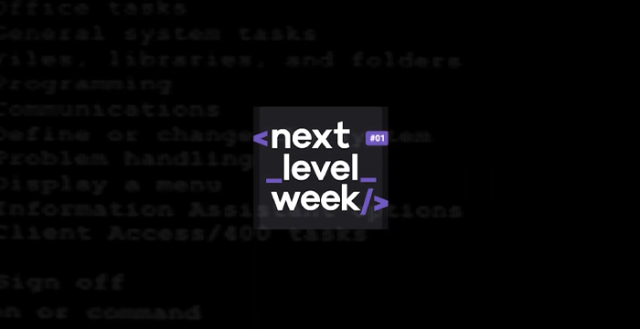

# Next Level Week - RocketSeat :rocket:

<h1 align="center">

</h1>

 <h2>🏷 Sobre o projeto</h2>
 
O projeto <b>Ecoleta</b> ♻ é uma iniciativa da <a  style="color:#a10ee0; href="https://github.com/Rocketseat" target="_blank"><b>RocketSeat</b></a> no contexto do <a href="https://pt.wikipedia.org/wiki/Dia_Mundial_do_Ambiente" targe="_blank"> <b>  Dia Mundial do Meio Ambiente</b> </a> ministrado pelo professor <a  style="color:#a10ee0; href="https://github.com/maykbrito" target="_blank"><b>Mayk Brito</b></a>.

 
Consiste na produção de uma aplicação web, para possiblitar à população informações sobre pontos de coleta de lixo reciclável, bem como cadastro de novos pontos de coleta para ampliar as ações de preservação ao meio ambiente. 

 <h2>🔎 Preview </h2>
 

##Especificações completas ao final do projeto :wink:

:construction: :construction: :construction: :construction: :construction: :construction:

<b> XXX</b>

