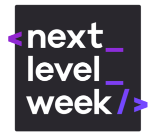
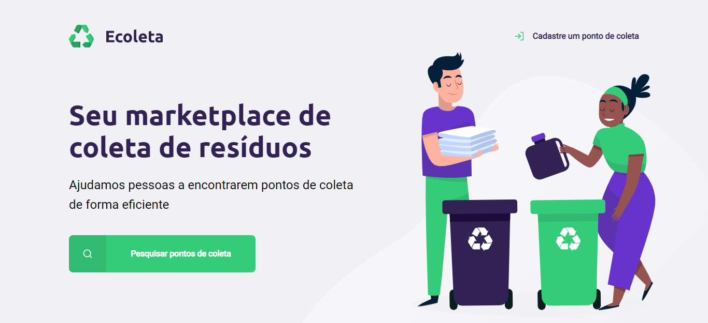
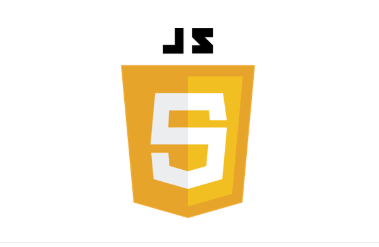
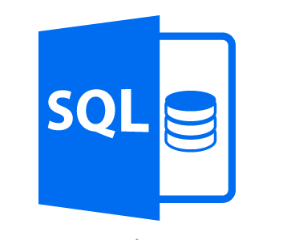
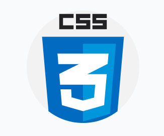

<h1 align="center">Next Level Week - RocketSeat :rocket:</h1>                                                         

<h1 align="center">
 
</h1>

<h2 align="center">
<a style="color:#a10ee0;" href="#about">About</a>  |
<a style="color:#a10ee0;" href="#preview">Preview</a>  |
<a style="color:#a10ee0;" href="#technologies">Technologies</a>  |
<a style="color:#a10ee0;" href="#contribute">Contribute</a>  |
<a style="color:#a10ee0;" href="#license">License</a> 
</h2>

<h2 id="about">🏷 About The Project</h2>

The Project <b>Ecoleta</b> ♻ is an initiative of<a href="https://github.com/Rocketseat" target="_blank"><b> RocketSeat</b></a> in the context of <a href="https://pt.wikipedia.org/wiki/Dia_Mundial_do_Ambiente" target="_blank"> <b>  World Environment Day</b> </a> taught by the teacher <a  href="https://github.com/maykbrito" target="_blank"><b>Mayk Brito</b></a>.

It consists in the production of a web application, to provide the population with information on recyclable garbage collection points, as well as registration of new collection points to expand actions to preserve the environment. 

<h2 id="preview">🔎 Preview </h2>

<h2 id="technologies">🧰 Used Technologies </h2>

  
  
  
  
  

<h2 id="contribute">🖇 Contribute</h2>
<ul>
    <li>Explore your creativity and skills</li> 
    <li>Make a fork;</li>
    <li>Create a branck with your feature: <code>git checkout -b my-feature</code>;</li>
    <li>Commit changes: <code>git commit -m 'feat: My new feature'</code>;</li>
    <li>Make a push to your branch: <code>git push origin my-feature</code>.</li>
</ul><h3>That's  it! 🖖</h3>

<h2 id="license">🖋 License</h2>

This project is under the MIT license. See the <a href="https://github.com/Camila-Isabela/Next-Level-Week/blob/master/LICENSE"><strong>License</strong></a> for more details.

